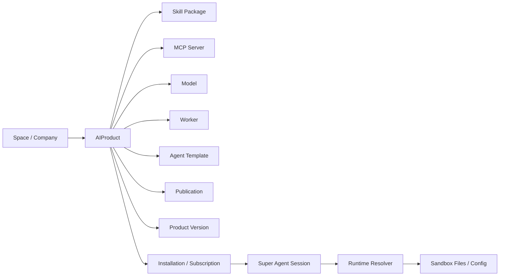

# HiMarket 对比与超级智能体资产市场参考计划

日期：2026-06-21

本文件用于把 `higress-group/himarket` 的实现方式与当前 `coze-studio` 超级智能体工程做一次可交接的深度对比，并给出后续可执行参考计划。目标不是照搬 HiMarket，而是吸收它在企业级 AI 能力市场、技能包生命周期、运行时会话配置、门户/订阅/凭证治理上的成熟骨架，补齐我们当前超级智能体 App Server 与技能商城之间缺少的统一资产层。

## 1. 本次阅读范围

### HiMarket 源码快照

- GitHub：<https://github.com/higress-group/himarket>
- 本地阅读路径：`/tmp/himarket-read`
- 读取方式：GitHub clone 连接被 reset 后，改用 GitHub codeload 下载 ZIP 并解压。
- 快照提交：`58d36f85c556ce9942a81c3b83d906081b7a5cc1`
- 提交时间：`2026-06-12T07:51:23Z`
- 提交信息：`feat: support AIRegistry skill management (#315)`

### 当前项目阅读范围

- 当前项目：`/Users/luzhipeng/projects/ynet/coze-studio`
- 重点阅读：
  - `/Users/luzhipeng/projects/ynet/coze-studio/docs/super-agent-harness-handoff-20260620.md`
  - `/Users/luzhipeng/projects/ynet/coze-studio/backend/api/handler/coze/super_agent_run_service.go`
  - `/Users/luzhipeng/projects/ynet/coze-studio/backend/api/handler/coze/super_agent_session_service.go`
  - `/Users/luzhipeng/projects/ynet/coze-studio/backend/api/handler/coze/super_agent_harness_service.go`
  - `/Users/luzhipeng/projects/ynet/coze-studio/backend/application/skill/skill_application.go`
  - `/Users/luzhipeng/projects/ynet/coze-studio/backend/application/singleagent/sandbox_skill.go`
  - `/Users/luzhipeng/projects/ynet/coze-studio/backend/domain/skill/entity/skill.go`
  - `/Users/luzhipeng/projects/ynet/coze-studio/frontend/apps/coze-studio/src/pages/skill-marketplace/index.tsx`
  - `/Users/luzhipeng/projects/ynet/coze-studio/frontend/apps/coze-studio/src/pages/space-skill/detail.tsx`
  - `/Users/luzhipeng/projects/ynet/coze-studio/frontend/packages/agent-ide/entry/src/modes/super-mode/super-session-sidebar.tsx`
  - `/Users/luzhipeng/projects/ynet/coze-studio/frontend/packages/agent-ide/entry/src/modes/super-mode/super-chat-area.tsx`

## 2. 总结结论

HiMarket 是一个企业级 AI 开放平台，核心不是单独的“技能商城”，而是一个统一的 AI 产品市场。它用 `Product` 抽象承载 Model、MCP Server、Agent API、Agent Skill、Worker 等多种能力，再通过 Portal、Publication、Subscription、Consumer、Credential 把“发布、展示、订阅、授权、运行时消费”串起来。

我们当前项目已经有不少超级智能体所需的底层能力：App Server manifest/openapi、sessions、runs、messages、trace、workspace、artifacts、approvals、harness state/snapshot/resume、标准技能包 `SKILL.md + scripts/references/templates/assets`、ZIP 校验/导入/导出、assets 管理、全局发布与审核队列、会话列表/重命名/删除、自动上下文压缩等。

主要差距是：这些能力现在还是以“super-agent 接口集合 + skill domain”为主，没有统一成公司级可运营的资产市场。下一阶段最应该借鉴 HiMarket 的不是 Java/Spring/Nacos/Higress 技术栈，而是它的产品化域模型、版本生命周期、门户级可见性、订阅/凭证治理、会话运行时解析器、技能详情页信息架构。

推荐方向：在不推倒现有 skill 实现的前提下，新增一个轻量 `AI Product / AI Asset` 层。第一期只把 Skill 包进去，后续再逐步纳入 MCP、Model、Worker、Agent Template。这样能保住当前已经实现的标准技能包能力，又能把商城、全局技能、空间技能、公司级分发、会话运行时选择统一起来。

## 3. HiMarket 架构要点

### 3.1 模块结构

HiMarket 是 Java 17 + Spring Boot 3.2.11 + Maven 多模块工程：

- `himarket-dal`：实体、Repository、Converter、Enum。
- `himarket-server`：Controller、Service、DTO、核心业务流程。
- `himarket-bootstrap`：启动、Spring 配置、Security、Flyway。
- `himarket-web/himarket-admin`：管理后台。
- `himarket-web/himarket-frontend`：开发者门户/市场/HiCoding。
- `deploy`：Docker Compose、Helm。
- `sandbox`：远程编码沙箱相关。
- `harness/config/environment.json`：给编码代理/自动化环境读取的项目结构、命令、启动、认证、依赖说明。

参考文件：

- `/tmp/himarket-read/docs/ARCHITECTURE.md`
- `/tmp/himarket-read/harness/config/environment.json`
- `/tmp/himarket-read/README_zh.md`
- `/tmp/himarket-read/USER_GUIDE_zh.md`

### 3.2 统一 Product 抽象

HiMarket 的核心实体是 `Product`：

- 文件：`/tmp/himarket-read/himarket-dal/src/main/java/com/alibaba/himarket/entity/Product.java`
- 关键字段：
  - `productId`
  - `adminId`
  - `name`
  - `type`
  - `description`
  - `document`
  - `icon`
  - `status`
  - `autoApprove`
  - `feature`
  - `enableConsumerAuth`

产品类型：

- 文件：`/tmp/himarket-read/himarket-dal/src/main/java/com/alibaba/himarket/support/enums/ProductType.java`
- 类型：
  - `REST_API`
  - `HTTP_API`
  - `MCP_SERVER`
  - `AGENT_API`
  - `MODEL_API`
  - `AGENT_SKILL`
  - `WORKER`

产品状态：

- 文件：`/tmp/himarket-read/himarket-dal/src/main/java/com/alibaba/himarket/support/enums/ProductStatus.java`
- 状态：
  - `PENDING`
  - `READY`
  - `PUBLISHED`

对我们的启发：

- 我们现在的 `Skill` 已经是一个领域模型，但 Marketplace 的主语仍是 Skill。
- 后续如果要公司级使用，商城主语应该提升为 `AIProduct`，Skill 只是 product type 之一。
- `Product.feature` 这种 JSON 扩展字段适合承载不同产品类型的差异化配置，能避免给每种资产都开一套完全不同的商城表。

### 3.3 Portal、Publication、Subscription、Consumer

HiMarket 的企业级市场不是“全局列表”这么简单，而是：

- `Portal`：门户/站点/租户入口，带 UI 配置、认证配置、域名配置。
- `ProductPublication`：产品发布到某个 Portal。
- `ProductSubscription`：开发者/Consumer 对某个 Product 的订阅与审批状态。
- `Consumer`：开发者侧调用方，带主 Consumer 概念。
- `ConsumerCredential`：Consumer 的 API Key / Credential。

参考文件：

- `/tmp/himarket-read/himarket-dal/src/main/java/com/alibaba/himarket/entity/Portal.java`
- `/tmp/himarket-read/himarket-dal/src/main/java/com/alibaba/himarket/entity/ProductPublication.java`
- `/tmp/himarket-read/himarket-dal/src/main/java/com/alibaba/himarket/entity/ProductSubscription.java`
- `/tmp/himarket-read/himarket-dal/src/main/java/com/alibaba/himarket/entity/Consumer.java`
- `/tmp/himarket-read/himarket-server/src/main/java/com/alibaba/himarket/service/impl/ConsumerServiceImpl.java`
- `/tmp/himarket-read/himarket-server/src/main/java/com/alibaba/himarket/service/impl/PortalServiceImpl.java`

对我们的启发：

- 我们当前的 `publish_scope private/space/global` 是好的第一步，但还不等价于企业级发布。
- 公司级技能商城至少需要区分：
  - 私有草稿
  - 空间可见
  - 公司全局可见
  - 官方/平台精选
  - 已安装/已订阅
  - 已下架/废弃
- 如果后续要给外部 App Server、CLI、远程 worker 使用，必须有 Consumer/Credential 或至少 installation token 的概念。

### 3.4 Skill 标准包与版本生命周期

HiMarket 对 Agent Skill 的处理重点在标准包与版本：

- 控制器：`/tmp/himarket-read/himarket-server/src/main/java/com/alibaba/himarket/controller/SkillController.java`
- ZIP 解析：`/tmp/himarket-read/himarket-server/src/main/java/com/alibaba/himarket/service/impl/SkillZipParser.java`
- SKILL.md 解析：`/tmp/himarket-read/himarket-server/src/main/java/com/alibaba/himarket/service/impl/SkillMdParser.java`
- 文件树：`/tmp/himarket-read/himarket-server/src/main/java/com/alibaba/himarket/service/impl/FileTreeBuilder.java`
- 服务实现：`/tmp/himarket-read/himarket-server/src/main/java/com/alibaba/himarket/service/impl/SkillServiceImpl.java`
- 配置：`/tmp/himarket-read/himarket-dal/src/main/java/com/alibaba/himarket/support/product/SkillConfig.java`

它提供的能力包括：

- 上传 ZIP package。
- 校验 `SKILL.md` 与 YAML front matter。
- 提取 name、description、instructions、resources。
- 支持根目录或 skill-name 包裹目录。
- 文件树浏览与文件内容预览。
- 版本列表、发布版本、审批发布版本、强制发布、设为 latest、删除草稿。
- 下载 ZIP。
- CLI 下载信息。
- 从 Nacos / AIRegistry 导入 Skill。

对我们的启发：

- 我们已经有标准技能包和 ZIP 校验，方向对。
- 还缺更完整的版本状态机：draft、ready、reviewing、approved、published、deprecated、latest。
- 还缺版本维度的安装历史、回滚、下载统计、精选标识。
- 还缺“管理员包管理页”和“用户详情页”的统一体验。

### 3.5 HiCoding 会话运行时解析

HiMarket 的 Coding Session 有一个很重要的链路：

前端只传 ID：

- 文件：`/tmp/himarket-read/himarket-server/src/main/java/com/alibaba/himarket/service/hicoding/session/CliSessionConfig.java`
- 字段：
  - `modelProductId`
  - `mcpServers[].productId`
  - `skills[].productId`
  - `authToken`

后端解析成完整运行时配置：

- 文件：`/tmp/himarket-read/himarket-server/src/main/java/com/alibaba/himarket/service/hicoding/session/ResolvedSessionConfig.java`
- 内容：
  - 模型 base URL / API Key。
  - MCP URL / transport / headers。
  - Skill 坐标与 registry 凭证。

再注入到沙箱：

- 文件：`/tmp/himarket-read/himarket-server/src/main/java/com/alibaba/himarket/service/hicoding/sandbox/init/SkillDownloadPhase.java`
- provider 目录：
  - `qodercli` -> `.qoder/skills/`
  - `claude-code` -> `.claude/skills/`
  - `qwen-code` -> `.qwen/skills/`
  - `opencode` -> `.opencode/skills/`

对我们的启发：

- 我们的超级智能体会话现在已有 create/list/get/rename/delete，但 create request 还没有 model/MCP/skill selection。
- 下一步要把 session 从“聊天容器”升级为“工程工作区运行配置”：
  - 用户选一个模型。
  - 选多个 MCP。
  - 选多个标准 Skill。
  - 后端解析权限、版本、凭证。
  - 沙箱启动/恢复时注入到对应目录。
  - harness snapshot 能展示当前 session 绑定了哪些资产。

### 3.6 UI 信息架构

HiMarket 前端值得借鉴的部分：

- 市场列表：`/tmp/himarket-read/himarket-web/himarket-frontend/src/pages/Square.tsx`
- Skill 详情：`/tmp/himarket-read/himarket-web/himarket-frontend/src/pages/SkillDetail.tsx`
- 管理端 Skill Package：`/tmp/himarket-read/himarket-web/himarket-admin/src/components/api-product/ApiProductSkillPackage.tsx`
- MCP 工具调用面板：`/tmp/himarket-read/himarket-web/himarket-frontend/src/components/McpToolCallPanel.tsx`
- Coding 工具调用分组：`/tmp/himarket-read/himarket-web/himarket-frontend/src/components/coding/ActivityGroupCard.tsx`
- Tool Call 卡片：`/tmp/himarket-read/himarket-web/himarket-frontend/src/components/coding/ToolCallCard.tsx`

关键可借点：

- 商城列表有类别、搜索、排序、卡片摘要。
- Skill 详情页有 Overview / Files，文件树、版本选择、安装命令、下载方式、相关技能。
- 管理端上传后不是结束，而是进入“版本状态 + 文件树 + 预览 + 发布动作”。
- 工具调用默认可以折叠，但必须显示摘要；展开后看参数、返回、状态、耗时。
- Coding workbench 把工具调用按 activity group 分组，用户能理解 agent 正在读、搜、改、执行什么。

## 4. 当前项目已实现能力

### 4.1 超级智能体 App Server 契约

当前已有机器可读契约：

- manifest：`GET /api/super-agent/manifest`
- openapi：`GET /api/super-agent/openapi.json`
- runs：创建、流式、取消、历史。
- sessions：create/list/get/rename/delete。
- messages：列表。
- trace：事件投影。
- approvals：审批列表/决策。
- artifacts：列表/获取/预览元数据。
- workspace：文件列表、读取、写入、删除、移动、grep、下载。
- sandbox：命令执行、patch。
- harness：state、plan、tooloutputs、cleanup、context、snapshot、resume。
- skills：创建、标准包校验、导入、导出、assets 管理、runtime import、marketplace list/get/install。

参考文件：

- `/Users/luzhipeng/projects/ynet/coze-studio/backend/api/handler/coze/super_agent_run_service.go`
- `/Users/luzhipeng/projects/ynet/coze-studio/backend/api/router/coze/api.go`

### 4.2 标准技能包

当前标准技能包约束：

- 必须有 `SKILL.md`。
- 支持：
  - `scripts/`
  - `references/`
  - `templates/`
  - `assets/`
- prompt-only 技能应被拒绝或迁移为标准包。
- ZIP 支持导入、校验、导出。
- assets 支持 list/get/upsert/delete。
- runtime 可以从沙箱 `/skills/<name>` 导入。

参考文件：

- `/Users/luzhipeng/projects/ynet/coze-studio/backend/application/skill/skill_application.go`
- `/Users/luzhipeng/projects/ynet/coze-studio/backend/application/singleagent/sandbox_skill.go`
- `/Users/luzhipeng/projects/ynet/coze-studio/backend/application/skill/skill_application_test.go`
- `/Users/luzhipeng/projects/ynet/coze-studio/backend/application/singleagent/sandbox_skill_test.go`

### 4.3 技能发布与 marketplace

当前 Skill entity 已有：

- `PublishScope`
  - `private = 1`
  - `space = 2`
  - `global = 3`
- `PublishedVersion`
- `PublishedAt`
- `PublishedBy`
- `ReviewStatus`
  - pending
  - approved
  - rejected
- `Version`
- `SkillVersion` immutable snapshot。

参考文件：

- `/Users/luzhipeng/projects/ynet/coze-studio/backend/domain/skill/entity/skill.go`
- `/Users/luzhipeng/projects/ynet/coze-studio/docs/ynet-database-sql/99-skill-version.sql`
- `/Users/luzhipeng/projects/ynet/coze-studio/docs/ynet-database-sql/100-skill-publish-marketplace.sql`
- `/Users/luzhipeng/projects/ynet/coze-studio/docs/ynet-database-sql/103-skill-review-status.sql`

### 4.4 会话和 harness

当前会话能力：

- `SuperAgentCreateSession`
- `SuperAgentListSessions`
- `SuperAgentGetSession`
- `SuperAgentRenameSession`
- `SuperAgentDeleteSession`
- 前端已有会话列表、当前会话、最近会话、重命名、删除、多选清理基础 UI。

参考文件：

- `/Users/luzhipeng/projects/ynet/coze-studio/backend/api/handler/coze/super_agent_session_service.go`
- `/Users/luzhipeng/projects/ynet/coze-studio/frontend/packages/agent-ide/entry/src/modes/super-mode/super-session-sidebar.tsx`

当前 harness 能力：

- 计划状态读写。
- 工具产物列表/读取/清理。
- 会话级上下文。
- snapshot 聚合 messages/runs/workspace/context/tooloutputs/artifacts/trace/approvals。
- resume handoff。
- trace 里能投影 `context.compacted` 等事件。

参考文件：

- `/Users/luzhipeng/projects/ynet/coze-studio/backend/api/handler/coze/super_agent_harness_service.go`
- `/Users/luzhipeng/projects/ynet/coze-studio/backend/application/singleagent/sandbox_workspace.go`
- `/Users/luzhipeng/projects/ynet/coze-studio/backend/application/singleagent/sandbox_workspace_test.go`

### 4.5 自动上下文压缩

当前已有自动上下文压缩实现：

- 触发阈值：`AGENT_CONTEXT_COMPACT_MAX_BYTES`
- 默认阈值：`160 * 1024`
- 近期消息保留：`AGENT_CONTEXT_COMPACT_RECENT_MESSAGES`
- 默认保留：`16`
- 只对 super-agent 生效，普通 agent 不压缩。
- summary 写入 session-scoped context summary path。
- 优先使用 LLM summary，失败时退回规则摘要。
- 注入模型的系统消息头：`Context summary (auto-compacted)`。

参考文件：

- `/Users/luzhipeng/projects/ynet/coze-studio/backend/domain/agent/singleagent/internal/agentflow/agent_flow_runner.go`
- `/Users/luzhipeng/projects/ynet/coze-studio/backend/domain/agent/singleagent/internal/agentflow/node_context_compaction_llm_test.go`
- `/Users/luzhipeng/projects/ynet/coze-studio/backend/domain/agent/singleagent/internal/agentflow/agent_flow_runner_test.go`

仍需补齐：

- summary 质量评测。
- 可观测指标：压缩前后 token、summary 来源、失败率。
- UI 上显示“已压缩上下文”的状态和可查看摘要。
- resume 时对 summary 与最新计划、工具产物、文件变更做一致性校验。

## 5. 差距矩阵

| 领域 | HiMarket | 当前项目 | 推荐动作 |
| --- | --- | --- | --- |
| 资产抽象 | `Product` 统一承载 Model/MCP/Skill/Worker | Skill 单独成域，super-agent API 独立 | 新增轻量 `AIProduct`，第一期仅包 Skill |
| 商城可见性 | Portal + Publication + Subscription | `private/space/global` scope | 保留 scope，新增 publication/install/subscription 记录 |
| 公司级治理 | admin/developer/consumer/credential | 主要依赖 space/user 权限 | 加 company/global/official/review/install history |
| 技能标准包 | ZIP + `SKILL.md` + 文件树 + 版本 | 已有 ZIP、标准目录、assets、version snapshot | 补 version status、latest、download、rollback |
| 技能注册中心 | Nacos / AIRegistry | DB 存储文件内容，沙箱 runtime import | 先保 DB，预留 registry adapter，不强绑 Nacos |
| 会话配置 | session config 传 model/MCP/skills IDs | session create 只有 bot/user/title | 扩展 session config，并持久化到 conversation ext 或新表 |
| 运行时注入 | resolved config -> CLI config + skills dir | 有 runtime skill import，但 session 选择未打通 | 增加 resolver，把选中资产注入 sandbox |
| 工具调用 UI | 默认折叠，摘要清晰，展开看参数/返回 | 已有 trace panel，但 UI 仍在调整 | 按 activity group/card 设计，保留参数/返回可查 |
| Harness | 项目环境配置 + coding sandbox init | App Server harness state/snapshot/resume | 两者合并：环境元信息 + 会话状态快照 |
| 自动压缩 | 未看到核心会话压缩实现 | 已有 super-agent history compaction | 补质量评测、可视化、恢复一致性 |
| 计量运营 | 有 observability/metering/billing 方向 | 有 observability metrics 起点 | 增 skill install/download/use/run/token 指标 |

## 6. 目标架构建议

### 6.1 建议新增领域：AIProduct

不要把当前 Skill 推倒重做。建议新增一个产品层，以兼容包装方式接入现有 Skill：



第一期只实现 `ProductTypeSkill`，不立即把 MCP/Model 全部纳入。这样能先让商城和技能全局分发稳定下来。

### 6.2 推荐表结构

建议新增迁移，例如：

- `/Users/luzhipeng/projects/ynet/coze-studio/docs/ynet-database-sql/104-ai-product-foundation.sql`
- `/Users/luzhipeng/projects/ynet/coze-studio/docs/ynet-database-sql/105-ai-product-session-config.sql`

建议表：

#### `ai_product`

- `id`
- `product_id`
- `space_id`
- `creator_id`
- `name`
- `description`
- `type`
- `status`
- `visibility`
- `icon_uri`
- `cover_uri`
- `document`
- `feature`
- `source_ref_type`
- `source_ref_id`
- `official`
- `featured`
- `download_count`
- `install_count`
- `created_at`
- `updated_at`

#### `ai_product_version`

- `id`
- `product_id`
- `version`
- `source_version`
- `content_hash`
- `status`
- `review_status`
- `review_note`
- `reviewer_id`
- `published_at`
- `created_at`

#### `ai_product_publication`

- `id`
- `product_id`
- `scope`
- `space_id`
- `company_id`
- `status`
- `published_version`
- `published_by`
- `published_at`

#### `ai_product_installation`

- `id`
- `product_id`
- `version`
- `target_space_id`
- `target_user_id`
- `installed_by`
- `install_mode`
- `created_at`

#### `super_agent_session_config`

- `id`
- `conversation_id`
- `agent_id`
- `space_id`
- `model_product_id`
- `mcp_product_ids`
- `skill_product_ids`
- `resolved_snapshot`
- `created_at`
- `updated_at`

是否单独建 `consumer`/`credential`，建议分两步：

- 内部公司级使用第一期可先用 `installation + user/space ACL`。
- 需要给外部 CLI/App Server/API Key 使用时，再加 `ai_consumer`、`ai_consumer_credential`。

### 6.3 推荐后端目录

建议新增：

- `/Users/luzhipeng/projects/ynet/coze-studio/backend/domain/aiproduct/entity`
- `/Users/luzhipeng/projects/ynet/coze-studio/backend/domain/aiproduct/service`
- `/Users/luzhipeng/projects/ynet/coze-studio/backend/domain/aiproduct/repository`
- `/Users/luzhipeng/projects/ynet/coze-studio/backend/domain/aiproduct/internal/dal`
- `/Users/luzhipeng/projects/ynet/coze-studio/backend/application/aiproduct`
- `/Users/luzhipeng/projects/ynet/coze-studio/backend/api/handler/coze/super_agent_product_service.go`
- `/Users/luzhipeng/projects/ynet/coze-studio/backend/api/handler/coze/super_agent_session_config_service.go`

### 6.4 Product 与现有 Skill 的映射

第一期映射：

- `ai_product.type = skill`
- `ai_product.source_ref_type = skill`
- `ai_product.source_ref_id = skill.skill_id`
- `ai_product.status` 由 skill publish/review 状态映射。
- `ai_product.feature` 存：
  - skill file roots
  - asset summary
  - category/tags/platforms
  - version
  - install commands

重要原则：

- 现有 `/api/super-agent/skills/*` 不删除。
- 新增 `/api/super-agent/products/*` 或 `/api/super-agent/marketplace/products/*`。
- 前端商城先切到 product 接口，skill 管理页仍可调用 skill 接口。

## 7. 分阶段实施计划

### Phase 0：冻结当前基线与交接验证

目标：避免继续在不稳定 UI/后端上叠加。

动作：

- 固化当前 handoff 文档：
  - `/Users/luzhipeng/projects/ynet/coze-studio/docs/super-agent-harness-handoff-20260620.md`
  - 本文件。
- 清点 226 环境可用磁盘，避免反复上传大包导致服务不可用。
- 本地与远程都确认：
  - `/api/super-agent/manifest`
  - `/api/super-agent/openapi.json`
  - sessions create/list/rename/delete
  - harness state/snapshot/resume
  - skill validate/import/export/assets/marketplace
- 不再大改聊天界面基础布局，除非明确是当前 UI 会话专项。

验收：

- 有一份最新 Playwright 记录。
- 有一个可复现的部署包路径和上传记录。
- manifest/openapi 能返回当前能力清单。

### Phase 1：新增 AIProduct 基础层，只包装 Skill

目标：让“技能商城”从 skill list 变成企业级产品市场的第一种产品。

后端动作：

- 新增 `ai_product`、`ai_product_version`、`ai_product_publication`、`ai_product_installation` 表。
- 新增 domain/application/API。
- 写一个 `SkillProductAdapter`：
  - skill create/update/publish/review 后同步 product。
  - product list/detail 从 product 读展示字段，从 skill 读文件树/资产快照。
- marketplace list 改为 product 口径：
  - 支持 keyword、category、scope、official、installed、sort。
  - 只返回已发布且 review approved 的全局产品。
- 保持旧 skill marketplace API 兼容。

前端动作：

- `/explore/project/latest` 只保留技能商店入口，不要展示其他商店。
- 首页 hero 可以使用 image-gen 生成的技能商城渲染图，但不要影响真实列表信息密度。
- 技能卡片从 product DTO 渲染：
  - 名称、描述、标签、版本、文件数、资产数、安装数、更新时间。
- 增加详情页：
  - Overview
  - Files
  - Versions
  - Install

测试：

- Product DAO/service 单元测试。
- 旧 skill marketplace API 回归。
- 新 product marketplace API contract 测试。
- 前端 card/detail basic render 测试。

### Phase 2：完善 Skill Package 生命周期

目标：技能包从“能上传”变成“可治理、可审、可回滚、可安装”。

后端动作：

- ZIP 校验强化：
  - max zip size。
  - max file count。
  - max total uncompressed size。
  - zip slip 防护。
  - 禁止可执行二进制默认进入 `scripts/`。
  - assets 允许图片/文本/模板资源，其他二进制要显式白名单。
- 增加版本状态：
  - draft
  - ready
  - reviewing
  - approved
  - published
  - deprecated
- 增加 latest 指针。
- 增加 download/install count。
- 增加 install history。
- 增加 rollback 到某个 `skill_version` 的能力。
- 增加 package diff：当前 draft vs published。

前端动作：

- 管理端上传 ZIP 后展示：
  - 校验结果。
  - 文件树。
  - SKILL.md preview。
  - 资产 preview。
  - 版本状态与发布动作。
- 详情页文件树默认不把所有内容铺满，用户能明确看到文件名、路径、大小、类型。

测试：

- ZIP fixture：
  - clean package。
  - missing SKILL.md。
  - nested root。
  - unsafe path。
  - oversize。
  - blocked executable。
  - image asset。
- export 再 import 的 round-trip。

### Phase 3：空间 + 全局 + 公司级商城治理

目标：满足“给全公司级别使用”的商城治理。

动作：

- 明确 scope：
  - private：作者/空间私有。
  - space：空间内共享。
  - company/global：公司级全局可见。
  - official：平台/管理员精选。
- 审核队列从 skill 迁移到 product view：
  - pending。
  - approved。
  - rejected。
  - review note。
- 增加 owner/team metadata：
  - creator。
  - owning space。
  - maintainer。
  - support contact。
- 增加安装目标：
  - install to space。
  - install to bot/session。
  - pin version。
- 增加卸载/更新：
  - update to latest。
  - rollback installed version。

建议暂不做：

- 多 portal 域名/OIDC 完整体系。
- 复杂外部开发者 Consumer 门户。
- 计费结算。

这些是 HiMarket 的平台化能力，但内部公司级先不需要一次性做到。

### Phase 4：会话运行时配置与 sandbox 注入

目标：让超级智能体会话真正像 Codex/Claude Code 的工作区，而不是普通调试框。

后端动作：

- 扩展 `SuperAgentCreateSession` request：
  - `model_product_id`
  - `mcp_product_ids`
  - `skill_product_ids`
  - `config`
- 或新增 `/api/super-agent/sessions/config/update`。
- 建立 `SuperAgentSessionConfigResolver`：
  - 校验 product 可见性、安装状态、版本。
  - 解析 skill package snapshot。
  - 解析 MCP server 配置。
  - 解析 model config。
  - 生成 `resolved_snapshot`。
- sandbox/harness 启动或 resume 时注入：
  - `.codex/skills/<skill>/`
  - `.claude/skills/<skill>/`
  - `.qwen/skills/<skill>/`
  - `.opencode/skills/<skill>/`
  - `.mcp.json`
  - 模型环境变量或配置文件。
- harness state 增加 `runtime_assets`：
  - model。
  - MCP。
  - skills。
  - pinned versions。
  - injected paths。

前端动作：

- 会话列表保留 rename/delete。
- 新建会话时可选择：
  - 模型。
  - 技能。
  - MCP。
  - 模板。
- 会话详情顶部展示当前绑定资产。
- 切换会话时恢复对应 runtime snapshot。

测试：

- 创建 session 带 skills。
- get session 返回 config。
- resume 后 sandbox 中有技能目录。
- MCP 配置脱敏，secrets 不进 trace 明文。
- 删除 session 清理 session-scoped plan/tooloutputs/context。

### Phase 5：工具调用与 trace UI 对齐

目标：工具调用默认不展开，但有摘要；展开能看参数、返回、耗时、状态。

后端动作：

- 统一 trace projection：
  - group id。
  - call id。
  - tool name。
  - category：read/search/edit/execute/fetch/mcp/skill。
  - args summary。
  - result summary。
  - raw args。
  - raw result。
  - status。
  - started_at。
  - ended_at。
  - duration。
  - file paths。
- 对长结果做 offload：
  - trace 只放摘要和 artifact/tooloutput link。

前端动作：

- 参考 HiMarket `ActivityGroupCard`：
  - group header 显示本轮做了什么。
  - 每个工具行默认一行摘要。
  - 展开显示 JSON 参数与返回。
  - 编辑类工具显示文件路径和 diff 统计。
- 聊天输入框固定底部，消息区在上方滚动。
- 发送后立即插入 assistant pending bubble，显示三点动画，直到 stream 输出第一段文字。

测试：

- tool call row collapsed summary。
- expand/collapse。
- long result truncation/offload。
- pending bubble immediate。
- stream first token 替换 loading。

### Phase 6：观测、配额、清理策略

目标：能在公司内部稳定运行，而不是只适合 demo。

动作：

- 指标：
  - product list/detail/install/download。
  - skill runtime import。
  - session create/resume/delete。
  - context compaction trigger/success/failure。
  - sandbox exec duration/failure。
  - tool output bytes。
- 清理策略：
  - session-scoped tooloutputs TTL。
  - artifacts TTL。
  - exported package TTL。
  - upload temp dir cleanup。
- 226 部署注意：
  - 上传前 `df -h`。
  - 不保留多份大备份。
  - 前端 dist/后端二进制只留最近一到两份。
  - 大型 Playwright 产物定期清理。

测试：

- cleanup dry-run/apply。
- disk low watermark 下阻止大 ZIP 上传。
- metrics endpoint 或日志检查。

### Phase 7：扩展到 MCP、Model、Worker、Agent Template

目标：从技能商城升级为完整超级智能体资产市场。

动作：

- ProductType 增加：
  - skill。
  - mcp_server。
  - model。
  - worker。
  - agent_template。
- MCP product：
  - server name。
  - transport。
  - endpoint。
  - headers policy。
  - tools schema。
- Model product：
  - provider。
  - base URL。
  - model id。
  - credential ref。
  - context length。
  - capability tags。
- Worker product：
  - runtime。
  - trigger。
  - deployment ref。
- Agent template：
  - prompt。
  - default skills/MCP/model。
  - workspace scaffold。

这一步应在 Skill product 稳定后再做。

## 8. API 设计建议

### Product APIs

建议新增：

- `POST /api/super-agent/products/create`
- `POST /api/super-agent/products/update`
- `POST /api/super-agent/products/delete`
- `POST /api/super-agent/products/list`
- `POST /api/super-agent/products/get`
- `POST /api/super-agent/products/publish`
- `POST /api/super-agent/products/review`
- `POST /api/super-agent/products/install`
- `POST /api/super-agent/products/uninstall`
- `POST /api/super-agent/products/versions/list`
- `POST /api/super-agent/products/versions/set-latest`

### Marketplace APIs

建议新增：

- `POST /api/super-agent/marketplace/products/list`
- `POST /api/super-agent/marketplace/products/get`
- `POST /api/super-agent/marketplace/products/install`
- `POST /api/super-agent/marketplace/products/download`

### Session Config APIs

建议新增或扩展：

- `POST /api/super-agent/sessions/create`
  - 增加 `model_product_id`
  - 增加 `mcp_product_ids`
  - 增加 `skill_product_ids`
- `POST /api/super-agent/sessions/config/get`
- `POST /api/super-agent/sessions/config/update`
- `POST /api/super-agent/sessions/runtime/resolve`

### Harness APIs

建议扩展：

- `GET /api/super-agent/harness/state`
  - 增加 `runtime_assets`。
- `POST /api/super-agent/harness/snapshot`
  - 增加 `include_runtime_assets`。
- `POST /api/super-agent/harness/resume`
  - 恢复/校验 runtime assets 注入状态。

## 9. 前端信息架构建议

### 技能商城首页

路径：`/explore/project/latest`

建议：

- 去掉二级侧边栏中其他商店。
- 只有技能商城时不展示“智能体/外部应用/插件商店”等入口。
- 顶部：
  - 技能商城标题。
  - 简短说明：公司级标准技能包。
  - 搜索。
  - 分类/排序。
  - 上传/发布入口按权限展示。
- hero 可使用生成图，但内容区必须第一屏可见，不要做成营销页。
- 卡片：
  - 标准技能包标识。
  - 描述。
  - category/tags。
  - 文件数/资产数/版本/安装量。
  - 官方/全局/空间标识。
  - 安装/查看详情。

### 技能详情页

建议 tabs：

- 概览：描述、适用场景、能力、依赖。
- 文件：文件树 + preview。
- 版本：版本列表、latest、状态、发布时间、hash。
- 安装：安装到空间、安装到会话、下载 ZIP、复制命令。
- 资产：图片/模板预览。

### 管理/上传页

建议流程：

1. 上传 ZIP。
2. 后端校验。
3. 展示校验结果。
4. 展示文件树与 SKILL.md。
5. 选择发布范围。
6. 提交审核/发布。
7. 审核通过后进入全局商城。

### 超级智能体会话页

建议：

- 左侧：会话列表。
- 中间：工作区文件/编辑器。
- 右侧：聊天与 trace。
- 输入框固定底部，历史在上方滚动。
- 新建会话支持选择模型、技能、MCP。
- 会话顶部展示 runtime assets。
- 工具调用面板：
  - 默认折叠。
  - 每行有摘要。
  - 展开看参数/返回。

## 10. 测试计划

### 单元测试

后端：

- `backend/domain/aiproduct/...`
  - product create/update/list/get。
  - publication visibility。
  - installation。
  - version status。
- `backend/application/aiproduct/...`
  - skill adapter sync。
  - marketplace list filtering。
  - install copies pinned skill version。
- `backend/application/skill/...`
  - ZIP validation fixtures。
  - assets MIME/size。
  - export/import round-trip。
- `backend/api/handler/coze/...`
  - product route contract。
  - session config route contract。
  - harness runtime_assets contract。

前端：

- 技能商城列表 render。
- 详情页 tabs。
- ZIP 上传流程。
- session asset selector。
- tool call card expand/collapse。

### 集成测试

本地：

- 创建标准技能。
- 发布到 global。
- 审核通过。
- marketplace list 能看到。
- install 到另一个 space。
- 新建 session 选择该 skill。
- harness state 能看到 runtime_assets。
- sandbox 中存在 `.codex/skills/<name>/SKILL.md`。
- run 后 trace 能看到 tool/skill 事件。

远程 226：

- 地址：`http://10.10.10.226:8896`
- 关键页面：
  - `/explore/project/latest`
  - `/space/7652614054615187456/bot/7652617174313336832/arrange`
- 每次上传前：
  - `df -h`
  - 检查旧备份数量。
  - 清理不需要的 dist/日志/Playwright 产物。
- Playwright 验证：
  - 页面加载无 console error。
  - 技能商城有侧边栏/正确 padding/卡片。
  - 上传 ZIP 可校验。
  - 详情页可看文件树。
  - 会话列表可新建/重命名/删除。
  - 发送消息后立即出现 pending assistant bubble。
  - 工具调用默认折叠且有摘要，展开可见参数/返回。

### 回归测试命令

本次文档没有修改代码，不需要运行全量 typecheck。后续实现代码时建议按改动范围运行：

后端：

```bash
cd /Users/luzhipeng/projects/ynet/coze-studio/backend
go test ./application/skill ./application/singleagent ./domain/skill/... ./api/router/coze ./api/handler/skill
```

前端：

```bash
cd /Users/luzhipeng/projects/ynet/coze-studio/frontend
pnpm test --filter coze-studio
pnpm typecheck
```

如果项目实际脚本名不同，以 `package.json` 和现有 CI 命令为准。

## 11. 部署与打包建议

### 本地前端测试

建议本地跑前端服务，后端通过 226 或本地代理：

```bash
cd /Users/luzhipeng/projects/ynet/coze-studio/frontend
pnpm install
pnpm dev
```

如果要连 226 后端，优先通过已有环境变量/代理配置，不要硬编码。

### 后端部署

建议形成固定脚本：

1. 本地构建。
2. 上传单个压缩包。
3. 远端解压到版本目录。
4. 切换 symlink。
5. 重启服务。
6. health check。
7. 失败回滚到上一版本。

### 226 空间注意

用户已经明确提醒 226 空间风险。建议所有上传动作前后都记录：

```bash
ssh dev@10.10.10.226 'df -h && du -sh /path/to/app/* 2>/dev/null | sort -h | tail'
```

注意不要在远端不断留下：

- 多份 frontend dist。
- 多份后端二进制。
- 大量 Playwright screenshot/json/html。
- 大量 ZIP package。
- 大量 npm/pnpm cache。

## 12. 参考 HiMarket 时不要照搬的部分

不要第一阶段照搬：

- Java/Spring Boot 分层。
- Nacos 作为强依赖。
- Higress/APISIX gateway 绑定。
- Portal 多域名与 OIDC 完整配置。
- billing/计费体系。
- 外部开发者 Consumer 门户。

原因：

- 我们当前核心目标是在线 Hermes/Codex/Claude Code-like 超级智能体，不是先做完整开放平台。
- 现有 Go + Coze Studio 技术栈已经有大量基础能力，照搬会打断当前演进。
- 内部公司级商城第一优先级是资产治理与运行时接入，而不是外部 API 商业化。

应该借鉴：

- Product 抽象。
- 产品发布/版本/审核生命周期。
- Marketplace 信息架构。
- Skill package 管理页。
- 会话 runtime resolver。
- tool call UI 摘要/展开模式。
- deployment/harness environment 元信息。

## 13. 推荐下一步执行顺序

最建议的下一步不是继续调 UI 细节，而是做一条后端可闭环的“产品化技能”主线：

1. 新增 `AIProduct` 表与 domain，先只支持 Skill。
2. 写 Skill -> Product 同步 adapter。
3. 新增 product marketplace list/get/install API。
4. 扩展 manifest/openapi，把 product/marketplace/session_config/runtime_assets 暴露出去。
5. 前端技能商城改为 product 数据源，但保留现有 skill upload/detail 能力。
6. 扩展 session config，允许选择 skill product。
7. harness state/snapshot 返回 runtime_assets。
8. sandbox 注入 `.codex/skills/<name>` 并用 Playwright + API 验证。

这条路径能最快把“标准技能包 + 全局技能商城 + 会话工程化运行时”串成一个可演示、可继续迭代的闭环。

## 14. 给下一个会话的接手提示

如果把本文件交给下一个 Codex/Claude Code 会话，建议直接让它从这里开始：

```text
请阅读：
1. /Users/luzhipeng/projects/ynet/coze-studio/docs/himarket-reference-comparison-plan-20260621.md
2. /Users/luzhipeng/projects/ynet/coze-studio/docs/super-agent-harness-handoff-20260620.md
3. /Users/luzhipeng/projects/ynet/coze-studio/backend/domain/skill/entity/skill.go
4. /Users/luzhipeng/projects/ynet/coze-studio/backend/application/skill/skill_application.go
5. /Users/luzhipeng/projects/ynet/coze-studio/backend/api/handler/coze/super_agent_run_service.go

然后先做 Phase 1：
- 新增 AIProduct 基础层，第一期只包装 Skill。
- 保持现有 /api/super-agent/skills/* 兼容。
- 新增 /api/super-agent/marketplace/products/list|get|install。
- 写 DB migration、domain/service tests、route contract tests。
- 修改 manifest/openapi。
```

## 15. 参考链接

- HiMarket 仓库：<https://github.com/higress-group/himarket>
- HiMarket 中文 README：<https://raw.githubusercontent.com/higress-group/himarket/main/README_zh.md>
- HiMarket 用户指南：<https://raw.githubusercontent.com/higress-group/himarket/main/USER_GUIDE_zh.md>
- HiMarket 架构文档：<https://github.com/higress-group/himarket/blob/main/docs/ARCHITECTURE.md>
- HiMarket ProductType：<https://github.com/higress-group/himarket/blob/main/himarket-dal/src/main/java/com/alibaba/himarket/support/enums/ProductType.java>
- HiMarket SkillController：<https://github.com/higress-group/himarket/blob/main/himarket-server/src/main/java/com/alibaba/himarket/controller/SkillController.java>
- HiMarket SkillDownloadPhase：<https://github.com/higress-group/himarket/blob/main/himarket-server/src/main/java/com/alibaba/himarket/service/hicoding/sandbox/init/SkillDownloadPhase.java>
- HiMarket SkillDetail UI：<https://github.com/higress-group/himarket/blob/main/himarket-web/himarket-frontend/src/pages/SkillDetail.tsx>
- HiMarket ActivityGroupCard UI：<https://github.com/higress-group/himarket/blob/main/himarket-web/himarket-frontend/src/components/coding/ActivityGroupCard.tsx>
